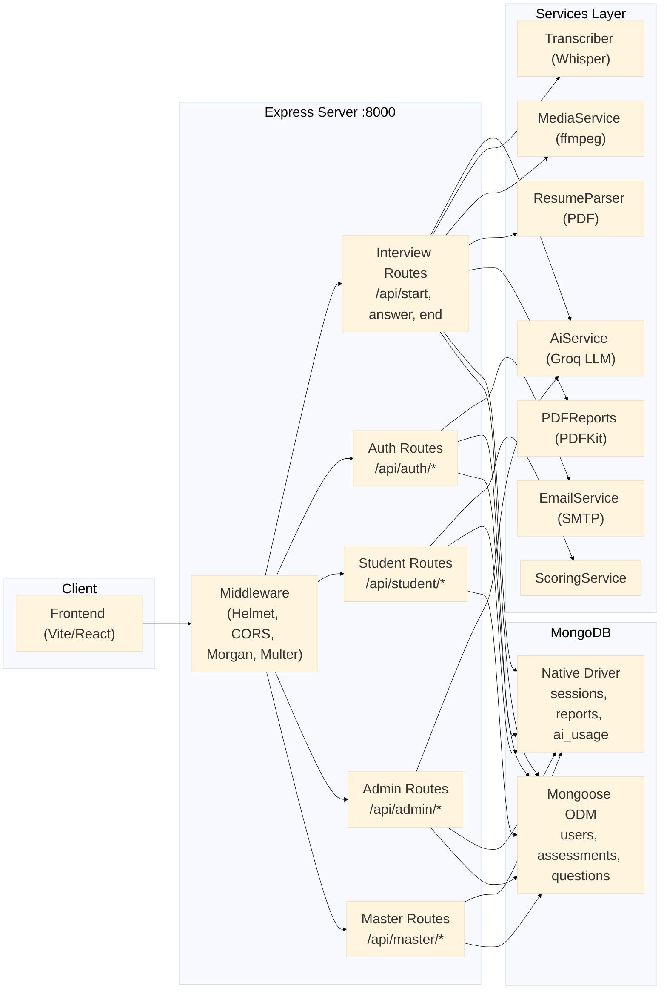
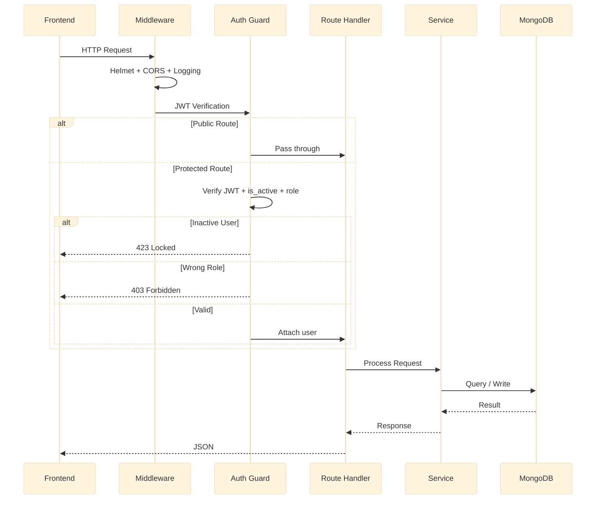
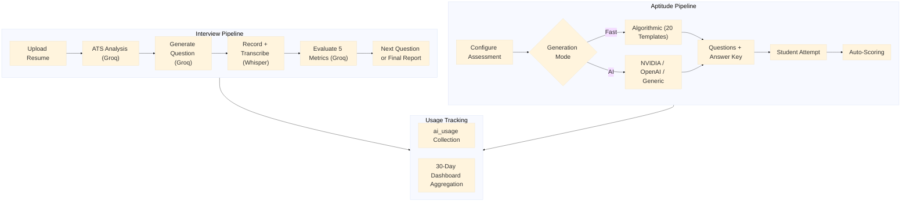
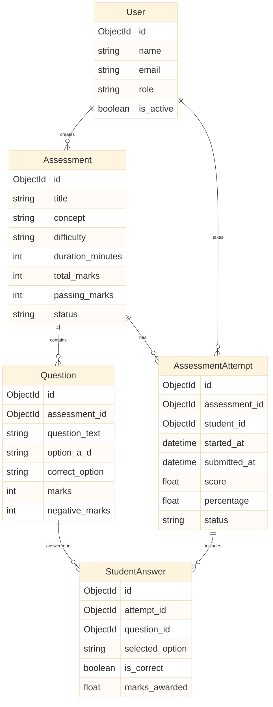
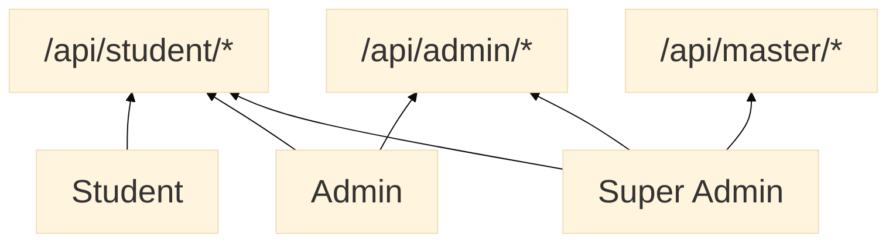

<p align="center">
  
  
  
  
  
  
  
</p>

<h1 align="center">Edvols Backend</h1>
<p align="center">
  <strong>Node.js + Express backend powering the Edvols AI-driven placement readiness platform</strong>
  <br/>
  Mock interviews · Aptitude assessments · AI evaluations · Reports & analytics
</p>

---

## System Architecture



---

## Request Lifecycle



---

## Anti-Cheating

### Duplicate Attempt Prevention

`POST /api/student/assessments/:id/start` returns **403 Forbidden** if the student already has an attempt with `status: "submitted"`. This is enforced in:

- `src/aptitude/routes/studentRoutes.js:1150-1158` (aptitude assessments)
- `src/programming/routes/assessmentStudentRoutes.js:85-87` (programming assessments)

No retakes are permitted once an assessment is submitted. The frontend catches the 403 and displays a modal on the listing page.

### Tab-Switch Auto-Submit

The frontend listens for the `visibilitychange` event and submits the attempt immediately on the first tab switch. The backend processes the submission normally — the check is purely client-side to prevent navigation away from the assessment.

---

## AI Pipeline



---

## Database Relationships



---

## Database Strategy

| Strategy | Used For | Collections |
|---|---|---|
| **Native Driver** | Interview system, legacy auth, AI tracking | `sessions`, `reports`, `ai_usage`, `users` |
| **Mongoose ODM** | Aptitude sub-system with schema validation | `users`, `assessments`, `questions`, `attempts`, `answers` |

---

## Role Hierarchy



---

## Tech Stack

| Category | Technology |
|---|---|
| **Runtime** | Node.js 20+ (ESM) |
| **Framework** | Express 4 |
| **Databases** | MongoDB 6+ (Native Driver + Mongoose 8) |
| **Authentication** | JWT (jsonwebtoken) + UUID v4 tokens |
| **AI / LLMs** | Groq SDK (LLaMA, Mixtral, Whisper) + OpenAI SDK (NVIDIA NIM) |
| **File Processing** | Multer, pdf-parse, mammoth, pdfkit, ffmpeg |
| **Security** | Helmet, bcryptjs, CORS |
| **Email** | Raw SMTP (net/tls) |
| **Utilities** | xlsx (CSV/Excel bulk import) |

---

## Getting Started

### Prerequisites

- Node.js >= 20
- MongoDB >= 6.0
- ffmpeg on PATH
- Groq API key
- (Optional) NVIDIA NIM API key

### Installation

```bash
git clone <repo-url>
cd backend
npm install
cp .env.example .env
npm run dev
```

Server starts at **http://localhost:8000**.

---

## Environment Variables

| Variable | Required | Default | Description |
|---|---|---|---|
| `MONGO_URI` | Yes | `Edvols` | Native driver connection |
| `MONGODB_URI` | Yes | same as above | Mongoose connection |
| `PORT` | No | `8000` | Server port |
| `JWT_SECRET` | Yes | — | JWT signing secret |
| `CLIENT_URL` | Yes | — | Frontend URL for CORS |
| `GROQ_API_KEY` | Yes* | — | Groq API key |
| `NVIDIA_NIM_API_KEY` | No | — | NVIDIA NIM key |
| `AI_PROVIDER` | No | `nvidia` | AI provider |
| `SMTP_HOST` | Yes* | — | SMTP server |

> \* Required if feature is used.

---

## API Endpoints

### Interview System

| Method | Endpoint | Description |
|---|---|---|
| `GET` | `/api/health` | Health status |
| `POST` | `/api/signup` | Register (UUID auth) |
| `POST` | `/api/login` | Login (UUID auth) |
| `GET` | `/api/me` | Current user profile |
| `POST` | `/api/start` | Upload resume, start interview |
| `POST` | `/api/answer_text` | Submit text answer |
| `POST` | `/api/answer_video` | Submit video answer |
| `POST` | `/api/end` | Finalize + generate report |
| `GET` | `/api/reports` | List reports |
| `GET` | `/api/report/:id` | Get full report |
| `GET` | `/api/report/:id/pdf` | Download performance PDF |

### Authentication

| Method | Endpoint | Description |
|---|---|---|
| `POST` | `/api/auth/signup` | Register (bcrypt + JWT) |
| `POST` | `/api/auth/login` | Login (bcrypt, scrypt fallback) |
| `POST` | `/api/auth/forgot-password` | Send reset email |
| `POST` | `/api/auth/reset-password` | Reset password |
| `GET` | `/api/auth/me` | Current user (JWT) |

### Student Routes — Role: `student`

| Method | Endpoint | Description |
|---|---|---|
| `GET` | `/api/student/dashboard` | Stats + analytics |
| `GET` | `/api/student/assessments` | Published assessments |
| `POST` | `/api/student/assessments/:id/start` | Start/resume attempt (returns **403** if already submitted — no retakes allowed) |
| `PUT` | `/api/student/attempts/:id/answers` | Save answer |
| `POST` | `/api/student/attempts/:id/submit` | Submit for scoring |
| `GET` | `/api/student/results` | All results |
| `GET` | `/api/student/results/:id` | Detailed result |

### Admin Routes — Role: `admin`

| Method | Endpoint | Description |
|---|---|---|
| `GET` | `/api/admin/dashboard` | Aggregate stats |
| `GET` | `/api/admin/analytics/aptitude` | Per-student analytics |
| `GET` | `/api/admin/analytics/interviews` | Interview analytics |
| `POST` | `/api/admin/assessments/generate` | AI/algorithmic generation |
| `GET` | `/api/admin/assessments` | List assessments |
| `POST` | `/api/admin/assessments` | Create blank assessment |
| `PATCH` | `/api/admin/assessments/:id/status` | Publish/unpublish |
| `PUT` | `/api/admin/assessments/:id/questions` | Bulk replace questions |
| `GET` | `/api/admin/assessments/:id/results` | Student results |
| `PATCH` | `/api/admin/attempts/:id/extend` | Extend attempt time |

### Master Admin Routes — Role: `master_admin`

| Method | Endpoint | Description |
|---|---|---|
| `GET` | `/api/master/dashboard` | Usage stats |
| `GET` | `/api/master/users` | List/search users |
| `POST` | `/api/master/users` | Create single user |
| `POST` | `/api/master/users/import` | Bulk import CSV/Excel |
| `PATCH` | `/api/master/users/:id/role` | Change role |
| `PATCH` | `/api/master/users/:id/revoke` | Revoke access |
| `PATCH` | `/api/master/users/:id/restore` | Restore access |
| `DELETE` | `/api/master/users/:id` | Delete user |
| `GET` | `/api/master/api-keys` | List API configs |
| `PATCH` | `/api/master/api-keys/:id` | Update API key |

---

## AI Models

| Model | Provider | Purpose |
|---|---|---|
| `llama-3.1-8b-instant` | Groq | Primary interview AI |
| `llama-3.3-70b-versatile` | Groq | Fallback interview AI |
| `mixtral-8x7b-32768` | Groq | Fallback interview AI |
| `whisper-large-v3-turbo` | Groq | Speech-to-text |
| `minimax-m2.7` | NVIDIA NIM | Aptitude generation (default) |

---

## Security

### Implemented

- bcrypt (cost 12) with legacy scrypt migration
- JWT 7-day expiry with configurable secret
- Sensitive fields excluded from queries (`select: false`)
- API keys stored in `.env` + memory, masked in responses
- CORS restricted to `CLIENT_URL`
- Helmet security headers globally
- Multer file limits: 5–8 MB
- Centralized error handler

### Audit Findings (requires attention)

| Severity | Issue | Location | Fix |
|---|---|---|---|
| **Critical** | Live API keys (Groq, SMTP, OpenAI, NVIDIA) committed to git history | `.env` tracked in git history | Rotate all keys immediately; add `.env` to `.gitignore`; purge from git history |
| **Critical** | `JWT_SECRET` set to placeholder `"your-secret-key-change-this-in-production"` | `.env` | Set a strong, unique secret via `openssl rand -hex 64` |
| **High** | CORS callback allows any origin when `CLIENT_URL` is undefined | `server.js` | Restrict with explicit allow list or throw on missing origin |
| **High** | Signup (`POST /api/auth/signup`) assigns `master_admin` by default | `authRoutes.js` | Default role should be `student` |
| **High** | Login has no rate limiting | `authRoutes.js` | Apply `express-rate-limit` to login endpoint |

---

## Project Structure

```
backend/
├── src/
│   ├── server.js                   # Entry point + interview routes
│   ├── config.js                   # Environment config
│   ├── db.js                       # Native MongoDB connection
│   ├── utils/
│   │   ├── auth.js                 # Password hashing + UUID
│   │   └── httpError.js            # HTTP error helpers
│   ├── services/
│   │   ├── aiService.js            # Groq interview AI
│   │   ├── aiUsageService.js       # AI usage tracking
│   │   ├── transcriber.js          # Whisper STT
│   │   ├── mediaService.js         # ffmpeg processing
│   │   ├── resumeParser.js         # PDF extraction
│   │   ├── emailService.js         # SMTP emails
│   │   └── pdfReports.js           # PDFKit reports
│   └── aptitude/
│       ├── config/
│       │   ├── db.js               # Mongoose connection
│       │   └── mongoose.js         # CommonJS bridge
│       ├── middleware/
│       │   ├── auth.js             # JWT + role guards
│       │   └── errorHandler.js     # Global error handler
│       ├── models/
│       │   ├── User.js
│       │   ├── Assessment.js
│       │   ├── Question.js
│       │   ├── AssessmentAttempt.js
│       │   └── StudentAnswer.js
│       ├── routes/
│       │   ├── authRoutes.js
│       │   ├── studentRoutes.js
│       │   ├── adminRoutes.js
│       │   └── masterAdminRoutes.js
│       ├── services/
│       │   ├── aiService.js        # Question generation
│       │   ├── scoringService.js   # Attempt scoring
│       │   └── fileTextService.js  # File extraction
│       └── utils/
│           ├── roles.js
│           ├── constants.js
│           ├── httpError.js
│           ├── asyncHandler.js
│           └── questionValidation.js
├── .env
└── package.json
```

---

## Scripts

| Command | Description |
|---|---|
| `npm run dev` | Development with file watching |
| `npm start` | Production start |

---

## License

ISC
