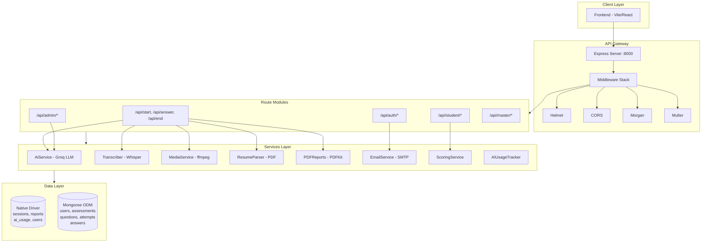
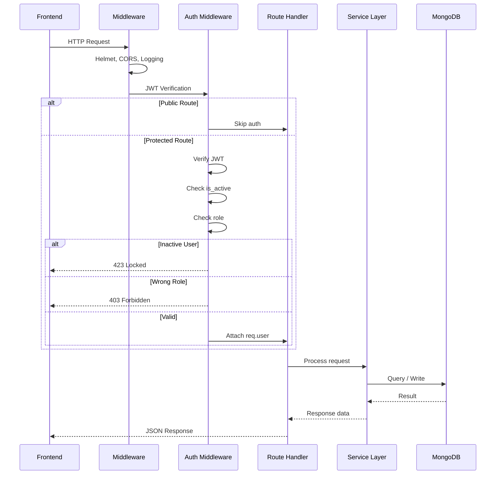
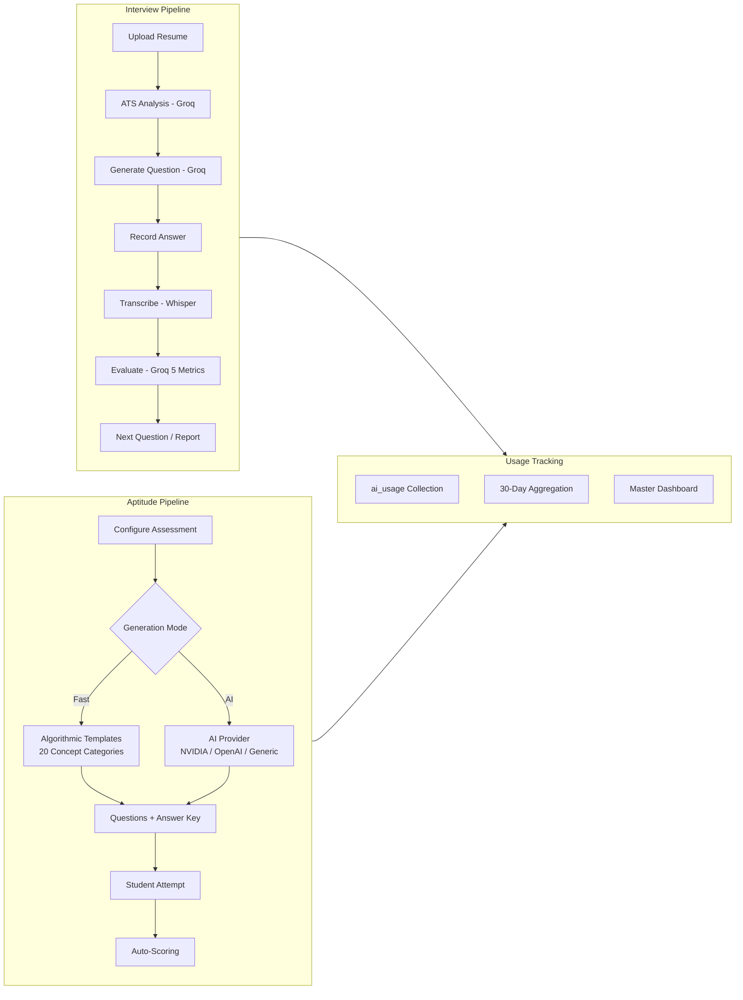
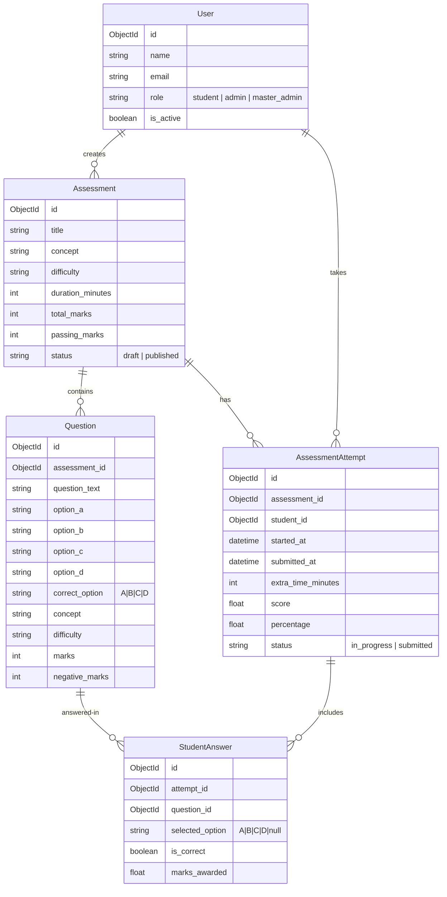

<p align="center">
  
  
  
  
  
  
  
</p>

<h1 align="center">PrepUp Backend</h1>
<p align="center">
  <strong>Node.js + Express backend powering the PrepUp AI-driven placement readiness platform</strong>
  <br/>
  Mock interviews · Aptitude assessments · AI evaluations · Reports & analytics
</p>

---

## System Architecture



---

## Request Flow



---

## AI Pipeline



---

## Database Relationships



---

## Database Strategy

The backend uses **two MongoDB connection strategies**:

| Strategy | Usage | Collections |
|---|---|---|
| **Native Driver** | Interview system, legacy auth, AI tracking | `sessions`, `reports`, `ai_usage`, `users` |
| **Mongoose ODM** | Aptitude assessment sub-system with schema validation | `users`, `assessments`, `questions`, `assessmentAttempts`, `studentAnswers` |

---

## Role Hierarchy

```mermaid
graph BT
    subgraph Roles["Three Role Tiers"]
        direction BT
        ST[Student]
        AD[Admin]
        SA[Super Admin]
    end

    subgraph AuthMethods["Authentication Methods"]
        direction LR
        JWT[JWT + bcrypt - Mongoose]
        UUID[UUID + scrypt - Native]
    end

    ST -->|Can access| JWT
    AD -->|Can access| JWT
    SA -->|Can access| JWT
    ST -->|Legacy| UUID

    subgraph RoutesPerms["Route Access"]
        direction LR
        R_STU[/api/student/*]
        R_ADM[/api/admin/*]
        R_MAS[/api/master/*]
    end

    ST --> R_STU
    AD --> R_ADM
    AD --> R_STU
    SA --> R_MAS
    SA --> R_ADM
    SA --> R_STU
```

---

## Tech Stack

| Category | Technology |
|---|---|
| **Runtime** | Node.js 20+ (ESM) |
| **Framework** | Express 4 |
| **Databases** | MongoDB 6+ (Native Driver + Mongoose 8) |
| **Authentication** | JWT (jsonwebtoken) + UUID v4 tokens |
| **AI / LLMs** | Groq SDK (LLaMA, Mixtral, Whisper) + OpenAI SDK (NVIDIA NIM) |
| **File Processing** | Multer, pdf-parse, mammoth, pdfkit, ffmpeg + ffprobe |
| **Security** | Helmet, bcryptjs, CORS |
| **Email** | Raw SMTP (net/tls) |
| **Utilities** | xlsx (CSV/Excel bulk import) |

---

## Getting Started

### Prerequisites

- Node.js >= 20
- MongoDB >= 6.0 (local or Atlas)
- ffmpeg + ffprobe on PATH
- Groq API key (interview AI + transcription)
- (Optional) NVIDIA NIM API key for aptitude AI generation

### Installation

```bash
git clone <repo-url>
cd backend
npm install
cp .env.example .env
npm run dev
```

Server starts at **http://localhost:8000**.

---

## Environment Variables

| Variable | Required | Default | Description |
|---|---|---|---|
| `MONGO_URI` | Yes | `mongodb://127.0.0.1:27017/prepup` | Native driver connection string |
| `MONGODB_URI` | Yes | same as above | Mongoose connection string |
| `PORT` | No | `8000` | Server port |
| `NODE_ENV` | No | `development` | Environment mode |
| `JWT_SECRET` | Yes | — | Secret key for JWT signing |
| `JWT_EXPIRES_IN` | No | `7d` | JWT expiration duration |
| `CLIENT_URL` | Yes | — | Frontend URL for CORS |
| `ADMIN_EMAILS` | No | — | Emails auto-assigned `admin` role |
| `MASTER_ADMIN_EMAILS` | No | — | Emails auto-assigned `master_admin` role |
| `GROQ_API_KEY` | Yes* | — | Groq API key (interviews, transcription, evaluations) |
| `NVIDIA_NIM_API_KEY` | No | — | NVIDIA NIM key (aptitude AI generation) |
| `NVIDIA_NIM_BASE_URL` | No | `https://integrate.api.nvidia.com/v1` | NVIDIA NIM API base |
| `NVIDIA_NIM_MODEL` | No | `minimaxai/minimax-m2.7` | NVIDIA NIM model |
| `AI_PROVIDER` | No | `nvidia` | AI provider: `nvidia`, `openai`, or `generic` |
| `SMTP_HOST` | Yes* | — | SMTP server for emails |
| `SMTP_USER` | Yes* | — | SMTP login |
| `SMTP_PASS` | Yes* | — | SMTP password |
| `SMTP_FROM` | No | — | Sender address |

> \* Required only if the corresponding feature is used.

---

## API Reference

### Interview System (server.js)

| Method | Endpoint | Auth | Description |
|---|---|---|---|
| `GET` | `/` | — | Health check |
| `GET` | `/api/health` | — | Full health status |
| `POST` | `/api/signup` | — | Register (UUID token auth) |
| `POST` | `/api/login` | — | Login (UUID token auth) |
| `GET` | `/api/me` | Bearer UUID | Current user profile |
| `POST` | `/api/start` | Bearer UUID | Upload resume, start interview |
| `POST` | `/api/answer_text` | Bearer UUID | Submit text answer |
| `POST` | `/api/answer_video` | Bearer UUID | Submit video answer |
| `POST` | `/api/answer_video_with_audio` | Bearer UUID | Submit separate video + audio |
| `POST` | `/api/end` | Bearer UUID | Finalize + generate report |
| `GET` | `/api/reports` | Bearer UUID | List reports |
| `GET` | `/api/report/:session_id` | Bearer UUID | Get full report |
| `GET` | `/api/report/:session_id/pdf` | Bearer UUID | Download performance PDF |
| `GET` | `/api/report/:session_id/ats` | Bearer UUID | Download ATS summary PDF |

### Authentication (authRoutes.js)

| Method | Endpoint | Auth | Description |
|---|---|---|---|
| `POST` | `/api/auth/signup` | — | Register (bcrypt) + auto role |
| `POST` | `/api/auth/login` | — | Login (bcrypt, scrypt fallback) |
| `POST` | `/api/auth/forgot-password` | — | Send reset email (5-min TTL) |
| `POST` | `/api/auth/reset-password` | — | Reset with token |
| `GET` | `/api/auth/me` | JWT | Current user profile |

### Student Routes (studentRoutes.js) — Role: `student`

| Method | Endpoint | Description |
|---|---|---|
| `GET` | `/api/student/dashboard` | Stats and analytics |
| `GET` | `/api/student/assessments` | Published assessments |
| `POST` | `/api/student/assessments/:id/start` | Start or resume attempt |
| `GET` | `/api/student/attempts/:id/time` | Remaining time |
| `PUT` | `/api/student/attempts/:id/answers` | Save answer |
| `POST` | `/api/student/attempts/:id/submit` | Submit for scoring |
| `GET` | `/api/student/results` | All results |
| `GET` | `/api/student/results/:id` | Result with per-question breakdown |

### Admin Routes (adminRoutes.js) — Role: `admin`

| Method | Endpoint | Description |
|---|---|---|
| `GET` | `/api/admin/dashboard` | Aggregate stats |
| `GET` | `/api/admin/analytics/aptitude` | Per-student analytics |
| `GET` | `/api/admin/analytics/interviews` | Interview analytics |
| `POST` | `/api/admin/assessments/generate` | AI/algorithmic generation |
| `GET` | `/api/admin/assessments` | List all assessments |
| `POST` | `/api/admin/assessments` | Create blank assessment |
| `GET` | `/api/admin/assessments/:id` | Assessment + questions |
| `PATCH` | `/api/admin/assessments/:id` | Update fields |
| `DELETE` | `/api/admin/assessments/:id` | Soft-delete |
| `PATCH` | `/api/admin/assessments/:id/status` | Publish/unpublish |
| `PATCH` | `/api/admin/assessments/:id/extend-duration` | Add time |
| `PUT` | `/api/admin/assessments/:id/questions` | Bulk replace questions |
| `GET` | `/api/admin/assessments/:id/results` | All student results |
| `PATCH` | `/api/admin/attempts/:id/extend` | Extend student attempt time |

### Master Admin Routes (masterAdminRoutes.js) — Role: `master_admin`

| Method | Endpoint | Description |
|---|---|---|
| `GET` | `/api/master/dashboard` | User counts + AI usage |
| `GET` | `/api/master/users` | List/search users (paginated) |
| `POST` | `/api/master/users` | Create user (single) |
| `POST` | `/api/master/users/import` | Bulk import via CSV/Excel |
| `PATCH` | `/api/master/users/:id/role` | Change user role |
| `PATCH` | `/api/master/users/:id/revoke` | Revoke user access |
| `PATCH` | `/api/master/users/:id/restore` | Restore user access |
| `DELETE` | `/api/master/users/:id` | Delete user |
| `GET` | `/api/master/api-keys` | List API configs (masked) |
| `PATCH` | `/api/master/api-keys/:id` | Update API key |

---

## AI Services

### Interview AI — Groq

| Model | Purpose | Fallback Order |
|---|---|---|
| `llama-3.1-8b-instant` | Primary | 1st |
| `llama-3.3-70b-versatile` | Fallback | 2nd |
| `mixtral-8x7b-32768` | Fallback | 3rd |

- Resume ATS analysis (score, skills found, improvements)
- Dynamic context-aware interview questions
- 5-dimension answer evaluation: confidence, body language, knowledge, fluency, skill relevance
- Overall report generation (strengths, weaknesses, tips)

### Speech-to-Text — Groq Whisper

- Model: `whisper-large-v3-turbo`
- Optimized for technical interview vocabulary

### Aptitude Question Generation

- **Fast mode (default):** Algorithmic generation using 20 concept templates — zero API calls, instant results
- **AI mode:** Configurable provider (NVIDIA NIM, OpenAI, or generic OpenAI-compatible)
- Configurable batch size (5) and concurrency (2) with per-question fallback
- Supports PDF, DOCX, TXT uploads as reference material

### Usage Tracking

Every AI call recorded to `ai_usage` collection with provider, model, feature, token counts, and status. 30-day aggregation available via master admin dashboard.

---

## Security

- Password hashing: bcrypt (cost 12) with legacy scrypt migration
- JWT: 7-day expiry, signed with configurable secret
- Sensitive fields (`password_hash`, `password_salt`, `password_reset_token`) excluded from queries via `select: false`
- API keys stored in `.env` + runtime memory; masked in responses
- CORS restricted to `CLIENT_URL`
- Helmet security headers applied globally
- Multer file upload limits: 5–8 MB
- Centralized error handler prevents stack traces in production

---

## Project Structure

```
backend/
├── src/
│   ├── server.js                   # Express entry point + interview routes
│   ├── config.js                   # Central environment config
│   ├── db.js                       # Native MongoDB connection
│   ├── utils/
│   │   ├── auth.js                 # Password hashing + UUID token gen
│   │   └── httpError.js            # HTTP error classes
│   ├── services/
│   │   ├── aiService.js            # Groq interview AI
│   │   ├── aiUsageService.js       # AI call tracking
│   │   ├── transcriber.js          # Whisper STT
│   │   ├── mediaService.js         # ffmpeg processing
│   │   ├── resumeParser.js         # PDF text extraction
│   │   ├── emailService.js         # Raw SMTP emails
│   │   └── pdfReports.js           # PDFKit report generation
│   └── aptitude/
│       ├── config/
│       │   ├── db.js               # Mongoose connection
│       │   └── mongoose.js         # CommonJS bridge
│       ├── middleware/
│       │   ├── auth.js             # JWT verification + role guards
│       │   └── errorHandler.js     # Global error handler
│       ├── models/
│       │   ├── User.js             # User schema
│       │   ├── Assessment.js
│       │   ├── Question.js
│       │   ├── AssessmentAttempt.js
│       │   └── StudentAnswer.js
│       ├── routes/
│       │   ├── authRoutes.js
│       │   ├── studentRoutes.js
│       │   ├── adminRoutes.js
│       │   └── masterAdminRoutes.js
│       ├── services/
│       │   ├── aiService.js        # Question generation
│       │   ├── scoringService.js   # Attempt evaluation
│       │   └── fileTextService.js  # File text extraction
│       └── utils/
│           ├── roles.js            # Role enum + email assignment
│           ├── constants.js        # Concepts, difficulties, statuses
│           ├── httpError.js        # HTTP error factory
│           ├── asyncHandler.js     # Express async wrapper
│           └── questionValidation.js
├── .env
└── package.json
```

---

## Scripts

| Command | Description |
|---|---|
| `npm run dev` | Development with file watching |
| `npm start` | Production start |
| `npm install` | Install dependencies |

---

## License

ISC
